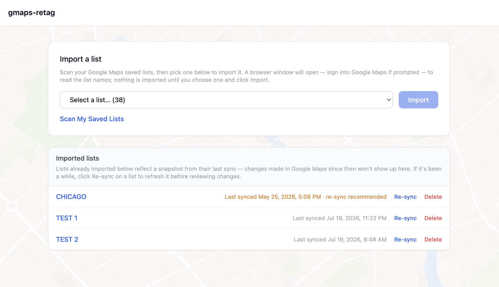
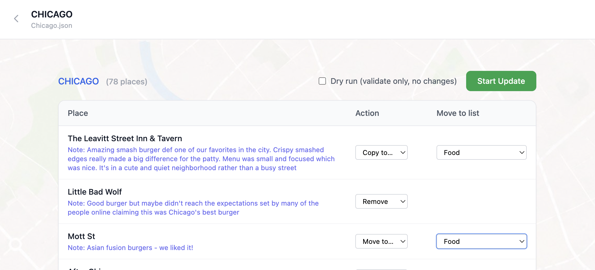
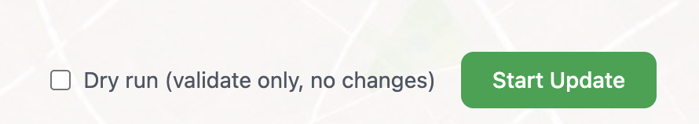

# gmaps-retag

A local tool for bulk-reviewing and retagging your Google Maps saved lists.

Because Google Maps has no public API for personal saved data, the tool drives a real browser via Playwright. All data stays on your machine — nothing is sent to any external service.

## Requirements

- [Bun](https://bun.sh) ≥ 1.3 (version pinned in `.bun-version`)
- Chromium (installed automatically by Playwright on first run)

## Setup

```bash
bun install
bunx playwright install chromium
```

## Usage

```bash
bun run start
```

Open **http://localhost:3000** in your browser.

### Page hierarchy

```
/                         Import a new list or browse previously imported ones
└── /collections/:f       Collection — review places, assign actions, run update
```

Each collection is a permanent URL. Browser back and forward work naturally throughout.

### Workflow

**Step 1 — Collect** (`/`)



Click _Scan My Saved Lists_. A browser window opens, navigates to Google Maps, and reads the names of all your saved lists — no places are scraped yet, just the list names. Once it finishes, pick one from the dropdown (lists you've already imported are left out, since re-syncing those is handled below) and click _Import_. That runs the full import — opens the target list, scrolls to load all places, and scrapes each one's name and note. Progress appears live as places stream in. When the run completes, the page redirects automatically to the new collection.

Previously imported lists appear below with a "Last synced" timestamp. Since each is a point-in-time snapshot, click _Re-sync_ next to a list to refresh it. The page recommends a re-sync when the snapshot is over a week old, or when a later update has changed that list in Maps (moved or copied a place into it, removed one from it, or appended a note) so your imported copy no longer matches.

While a scan or import is running, a _Cancel_ button is available if it gets stuck.

**Step 2 — Review** (`/collections/:fileName`)

The collection page shows every place with its address and note. For each place choose _Keep_, _Remove_, _Move to…_, or _Copy to…_ (the latter two need a target list name). Places you leave as _Keep_ are ignored by the update. _Move_ removes the place from the source list once it's added to the target; _Copy_ adds it to the target list while leaving it in the source list. If the place has a note, _Copy_ and _Move_ carry it over to the target list — appended after whatever note the place already has there, if any, rather than overwriting it.



**Step 3 — Update** (same page)

Check _Dry run_ if you just want to validate selectors without touching real data, then click _Start Update_. The browser navigates back to Maps and applies every marked change. Progress is shown inline; individual failures are logged without stopping the rest of the run.

### Dry-run mode

Dry run is a per-update choice you opt into from the UI: tick the _Dry run_ checkbox above the action table before clicking _Start Update_. The browser navigates all the way through to the save popup for each place and resolves every selector — but the final list-entry clicks are skipped. An amber banner appears on the collection page and it logs what _would_ have been applied instead of applying it.



### Cancelling a run

Both the import screen and the update screen have a _Cancel_ button for when the automation gets stuck (Maps never finishing a load, or a scroll loop that never reaches the bottom).

**Cancelling an update is not an undo.** An import only reads, so stopping it loses nothing. An update may already have written some changes to Maps by the time you cancel — those stay; the run just stops where it is and tells you how many actions completed. See [docs/cancellation.md](./docs/cancellation.md) for the details.

### The automation window

The browser window the tool drives **stays open between runs** — that's deliberate. It keeps you logged in and lets the next import or update start immediately instead of reopening and re-authenticating each time. You can close it whenever you like (the window's own close button is fine); the tool simply opens a fresh one on the next run, and your Google login is remembered either way. It also closes on its own when you stop the server.

## Where your data lives

Everything is written to `output/` (git-ignored) and never leaves your machine: your imported collections, the list of saved-list names, and a per-session change log under `output/logs/`.

### Undoing a mistake

Every change the tool makes to Google Maps is recorded in a session log at `output/logs/session_<timestamp>.jsonl` — a fresh file each time the server starts. Each line is one change (a place added to a list, removed from a list, or a note appended), recorded in enough detail to reverse it by hand:

- an **add** is undone by removing the place from that list,
- a **remove** is undone by adding it back,
- a **note** change stores the previous text, so you can restore it.

There's no automatic undo button, but the log is an exact, time-ordered record of what happened — so if a run does something you didn't intend, you can open the log and walk the changes back in Maps yourself. See [docs/session-logging.md](./docs/session-logging.md) for the format and [docs/architecture.md](./docs/architecture.md#output-files) for the other files.

## Accuracy & reporting problems

This tool automates a real browser against Google Maps' live website — which changes without notice and has no official API for personal saved data. **100% accuracy is not guaranteed.** A run can occasionally skip a place, misread a note, or fail on a page element that Maps has changed. So:

- Use **Dry run** first when you're unsure — it walks through every change and reports what it _would_ do without writing anything.
- Sanity-check important changes afterward, and keep the session log (above) as your safety net.

If you notice a bug, a wrong result, or anything that looks off, please **[open a GitHub issue](https://github.com/E-Kuerschner/gmaps-retag/issues)**. Describe what you did and, if you can, include the relevant lines from the session log — reports like that are the main way selector breakages get found and fixed.

## Development

Run in watch mode to restart on file changes:

```bash
bun run dev
```

For contributors: the design — process model, state and SSE communication, the Playwright module breakdown, and how selectors are kept resilient to Maps changes — is documented under [`docs/`](./docs):

- [docs/architecture.md](./docs/architecture.md) — process model, state, routing, SSE, Playwright modules, output files
- [docs/session-logging.md](./docs/session-logging.md) — the per-session change log and how it supports undo-by-hand
- [docs/cancellation.md](./docs/cancellation.md) — how cancelling a stuck run works
